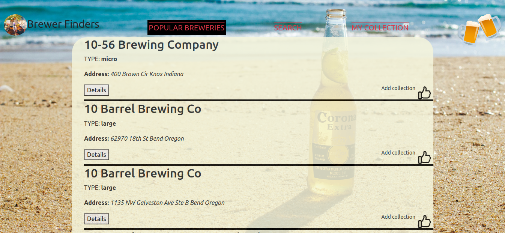

# Phase-1-project-Brewers-Finders

Moringa School phase-1-project Brewers Finders is a web-app to find your favourite breweries. It utilizes data from open brewery DB API

        https://api.openbrewerydb.org/

## Description

The goal of Brewers finders online web-app is to maintain a digital record and provide access
to your favorite breweries and their information on brewery-related data. On launch the web-app is
expected to provide a user experience that allows:

1. LogIn and Authentication with dummy data

2. Access to major breweries

3. Provides information on breweries

4. Save their preferred breweries.

5. Search for breweries in the database

## Built With

- HTML
- CSS
- JavaScript
- [Bootstrap](https://getbootstrap.com/)

## Getting Started

To get started you need to do the following:

## Alternative One

Use Github pages to check out website and perform operations from there.The link is:

        https://sammy-ck.github.io/phase-1-project/

## Alternative Two

### Installation

To use this repo on your machine requires some simple steps

- Open a terminal / command line interface on your computer

- Clone the repo by using the following:

        git@github.com:Sammy-CK/phase-1-project.git

- Be patient as it creates a copy on your local machine for you.

- Change directory to the repo folder:

        cd phase-1-project

- Install javascript dependencies

          npm install

### Running the application

To open site in browser run while inside the cloned repo:

        explorer.exe index.html

Run program from the index.html file in browser.

This is what the app looks like : 

# Author

- [@Sammy-CK](https://www.github.com/Sammy-CK)

# License

Released under the following license:

- [MIT](https://choosealicense.com/licenses/mit/)

Copyright © 2022, Sammy-CK
